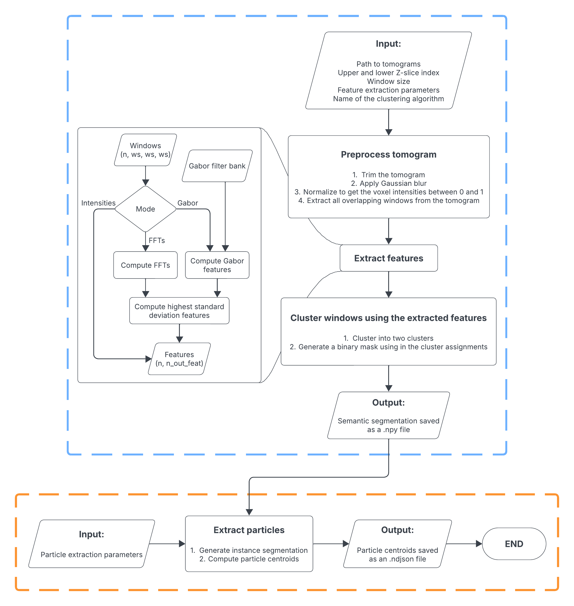

<a href="https://pubmed.ncbi.nlm.nih.gov/38391029/">
    
</a>

[](https://doi.org/) #TODO: Update Zenodo badge
 

# **PickET:** Unsupervised particle picking protocol for cryo-electron tomograms
Python package to pick particles in cryo-electron tomograms in an unsupervised manner


#TODO need to refine this as a graphical abstract. 

## Publication and Data
* Shreyas Arvindekar, Omkar Golatkar, and Shruthi Viswanath, **PickET - A library of methods for unsupervised particle-picking from cryo-electron tomograms**, . #TODO: Add a formal citation
* Data is deposited in [Zenodo](https://www.doi.org/) #TODO: Update Zenodo ID
#TODO zenodo contains installer of TomoEED.

## Dependencies:
* Python dependencies are mentioned in `requirements.txt`.
* CuPy
* TomoEED
Instructions for installing the Python dependencies as well as CuPy are provided below:

## Installation:
1. Install all the dependencies:
```
pip install -r requirements.txt
```
2. Install CuPy:  
    **If the CUDA version is `12.<something>`, install CuPy by running**  
    ```
    pip install cupy-cuda12x
    ```   
    **Else if CUDA version is `11.<something>`, install CuPy by running.**  
    ```
    pip install cupy-cuda11x
    ```
    **_Note:_** The CUDA version can be checked by running `nvidia-smi` from the terminal.
    
#TODO preprocessing before running pickET
Run TomoEED (provide ref and link to software and command used to run). 

#TODO show pics of outputs at each step. 

## Run PickET

### Overall workflow
The workflow for running PickET is split into two steps - S1 and S2. 

The first step (S1, semantic segmentation) identifies voxels corresponding to particles in each input tomogram. This step involves three feature extraction modes (abc) and two clustering methods (de) to classify each voxel as particle or background. In total, this generates six semantic segmentations for each input tomogram. The users can then choose to proceed with using one or more of these segmentations for the second step. 

In the second step (S2, particle extraction), particles are segmented in the tomogram using two methods (gh), allowing the user to choose between the two. The centroids of predicted particles and/or subtomograms enclosing the predicted particles are provided as output. STA. 

### Step 1 (S1): Generate semantic segmentations 

#### Inputs for S1:

Inputs for S1 are provided through a YAML file containing parameters. An example is provided in `examples/s1_params_example.yaml`. 

These parameters are described in detail below:

    dataset_name: <An identifier for the dataset> 
    
This will also be the name of the directory where all the outputs will be saved.

    inputs: 
    [  
        {
        tomogram: <path_to_tomogram_1>,
        lower_z-slice_limit: <upper_zslice_where_the_lamella_starts>, #[Optional]#
        upper_z-slice_limit: <lower_zslice_where_the_lamella_ends> #[Optional]#
            },
        {
        tomogram: <path_to_tomogram_2>,
        lower_z-slice_limit: <upper_zslice_where_the_lamella_starts>, #[Optional]#
        upper_z-slice_limit: <lower_zslice_where_the_lamella_ends> #[Optional]#
            },
    ]

TODO zslices are very good ... e.g. usually the central z slice with less non cell things (Fig 2). 


This list can be expanded with similar entries, enclosed in curly brackets as shown above. If the user does not want to specify the entries marked as `#[Optional]#` in the `input` section shown above, they should delete these lines from the `param_file.yaml`.

    neighborhood_size: 5   
    
We recommend using the $window\_size: 5$ for picking particles from tomograms. This corresponds to a neighborhood of 5x5x5 voxels around a given voxel. 

    max_num_neighborhoods_for_fitting: 100_000_000 #TODO neighborhoods
    
This parameter specifies the number of voxel neighborhoods to be used in the first pass to fit the clustering algorithm. 

Note: Reducing this number will reduce the computational power required, but will come at the cost of performance. On the contrary, increasing this number might require more computing power and may result in better segmentations. 
The users can see the number of neighborhoods being used in a given run by referring to the terminal output for the run. It will be shown as `Features array of shape: (<num_neighborhoods_being_used>, 125)` in the output.
We recommend users to optimize this number according to the computing power available. The users will need to optimize this number only once for their computing system. Once optimized, the same can be used for all datasets that will be processed using PickET on that computing node in the future.

    feature_extraction_params: 
    [
        {
        mode: ffts, 
        n_fft_subsets: 64,
            },
        
        {
        mode: gabor, 
        num_sinusoids: 10, 
        num_neighborhoods_subsets: 5,
        num_parallel_filters: 8,
        num_output_features: 64
            },
        
        {
        mode: intensities
            }  
    ]
    
These hyperparameters describe the feature extraction process. `feature_extraction_params` is also a list of dictionaries, similar to the `inputs`. Each dictionary defined in this list defines a feature extraction mode. Here, we provide three feature extraction modes `ffts`, `gabor` and `intensities`. 

First, for `mode: ffts`, there is only one hyperparameter, `n_fft_subsets`. This hyperparameter defines how many neighborhoods will be processed simultaneously for feature extraction. Higher the value, the faster the process, but higher the computational memory requirement.

Second, for `mode: gabor`, there are four key hyperparameters. The number of Gabor filters is the cube of the `num_sinusoids`. The user may choose to not tweak this hyperparameter (the developers can). The `num_neighborhoods_subsets` and `num_parallel_filters` define the number of neighborhoods and number of Gabor filters to be processed simultaneously. Increasing the `num_neighborhoods_subsets` and reducing the `num_parallel_filters` will result in the feature extraction requiring less GPU memory, but will result in longer runtimes. The `num_output_features` defines the number of features with the highest standard deviation to be used for clustering. The user may choose not to tweak this hyperparameter (the developers can).

Third, for `mode: intensities`, there are no hyperparameters. It will use the voxel intensities obtained from the neighborhoods as features for clustering.

    clustering_methods: [kmeans, gmm]
    
The `clustering_methods` list described the clustering algorithms to be used. In this example, both `KMeans` as well as `GMM` will be used for clustering.

    output_dir: /data/picket_results/
    
As the name suggests, `output_dir` describes the path to the directory where the output segmentations will be saved.  
*Note:* The segmentations will be saved in `output_dir/dataset_name` directory.

#### Running S1:


First, run the following command to generate the six semantic segmentations.

```
python s1.py <s1_param_file_path>
```

#### Visualizing segmentations from S1:

Second, run the following command on each of the segmentation to visualize an overlay of the segmentation on the input tomogram in Napari:
```
python see_segmentations.py <path_to_segmentation>
```
An overlay of these on the input tomogram can be visualized in Napari by running `python see_segmentations.py <path_to_segmentation>`. 

#TODO say that you need to look at 6 segmengations. and pick the one where particles are best separated from background. You may choose to select more than 1 for next step. 
Say that you need to look at seg and get the cluster index corresponding to particle. (hover around napari output to get) This is the `particle_cluster_id` to be used in the next step

*Note:* The `particle_cluster_id` is essentially the voxel intensity for the voxel corresponding to particles voxel in the segmentation.
From this step, the users will also get the `particle_cluster_id` for each of the segmentation, which will be needed for S2.

### Step 2 (S2): Extract particles  

#### Inputs for S2:
An example set of params for S2 are provided in `examples/s2_params_example.yaml`. These parameters are described in detail below:

    dataset_name: <An identifier for the dataset>
This will also be the name of the directory where all the outputs will be saved.

    inputs: 
    [  
        {
            segmentation: <path_to_segmentation_1>, 
            particle_cluster_id: 1,  # Cluster index of the particle cluster 
            lower_z-slice_limit: <upper_zslice_where_the_lamella_starts>, #[Optional]#
            upper_z-slice_limit: <lower_zslice_where_the_lamella_ends> #[Optional]#
            },
        {
            segmentation: <path_to_segmentation_1>, 
            particle_cluster_id: 0,
            lower_z-slice_limit: <upper_zslice_where_the_lamella_starts>, #[Optional]#
            upper_z-slice_limit: <lower_zslice_where_the_lamella_ends> #[Optional]#
            },
    ]
    
TODO segmentation and corresponding particle_cluster_id come from selections in the previous step. 

TODO zslices are ... can be much larger than in S1 and can correspond to all regions where particles can be found (Fig 2). 

This list can be expanded with similar entries, enclosed in curly brackets as shown above.

    particle_extraction_params: 
    [
        {mode: connected_component_labeling},
        {mode: watershed_segmentation, min_distance: 15}
    ]
Similar to the `inputs`, `particle_extraction_params` is also a list of dictionaries. Each dictionary defined in this list defines a particle extraction mode. Here, we provide two particle extraction modes `connected_component_labeling` and `watershed_segmentation`. 

First, for `mode: connected_component_labeling`, there are no hyperparameters. This mode is fast and works well for less crowded datasets.

Second, for `mode: watershed_segmentation`, there is one hyperparameter. This mode uses the watershed segmentation workflow for splitting semantic segmentation into instance segmentation. It uses the `min_distance` hyperparameter that defines the minimum separation between two detected particles in voxels.

    extract_subtomograms: True
    subtomogram_size: 31
Setting the value of `extract_subtomograms` to `True` will result in extracting the subtomograms of size `subtomogram_size` around each predicted particle centroid in .npy file format. If the user does not wish to extract the subtomograms or wants only the centroids, they can set `extract_subtomograms` to `False`. In this case, the value set to `subtomogram_size` will be ignored.

    output_dir: /data/picket_results/
As the name suggests, `output_dir` describes the path to the directory where the output segmentations will be saved.  
*Note:* The extracted particle centroid coordinates will be saved as `.ndjson` files in `output_dir/dataset_name/predicted_particles/` directory. And, the subtomograms, if extracted, will be saved in `output_dir/dataset_name/predicted_particles/subtomograms/` directory.


#### Running S2:
Run the following command to obtain centroids for predicted particles.

```
python s2.py <s2_param_file_path> 
```

Second, run the following command on each of the segmentation to visualize an overlay of the segmentation on the input tomogram in Napari:
```
python see_segmentations.py <path_to_segmentation>
```
An overlay of these on the input tomogram can be visualized in Napari by running `python see_segmentations.py <path_to_segmentation>`. 

TODO show pics of outputs at each step for it to look tutorial-like and less scary

TODO readthedocs? 

#### Visualizing segmentations from S2: 

An overlay of these on the input tomogram can be visualized in Napari by running `python see_segmentations.py <path_to_segmentation>`.

Strandard outputs. To convert it to just centroids, use this script. 
Optionally to get 
Use script to get XYZ in CSV instead of YAML

You can see YAML, XYZ, see_centroids, and also the instance segmentations. 

1. Script to get XYZ in CSV instead of YAML
2. Flag for saving instance segmentations. 
3. see_centroids to get centroids overlaid on segmentation

TODO make sure assessment scripts to say where the scripts are that were used for paper reproducibility. Consider doing this as a separate README in another folder.  

## Information
__Author(s):__ Shreyas Arvindekar, Shruthi Viswanath  
__Date__: June 1st, 2025  
__License:__ [CC BY-SA 4.0](https://creativecommons.org/licenses/by-sa/4.0/)
This work is licensed under the Creative Commons Attribution-ShareAlike 4.0
International License.  
__Testable:__ Yes  
__Publications:__  Arvindekar, S., _et. al._ PickET - A library of methods for unsupervised particle-picking from cryo-electron tomograms, . #TODO: Add a formal citation
