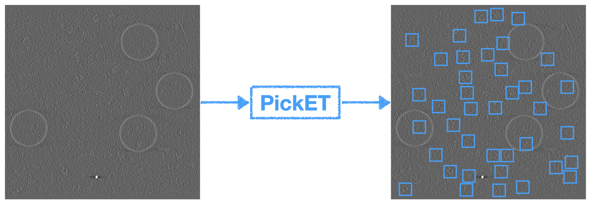

 
#TODO: Update Zenodo badge
 

# **PickET:** Unsupervised particle picking protocol for cryo-electron tomograms
Python package to pick particles in cryo-electron tomograms in an unsupervised manner

## Table of contents:
1. [Getting started](docs/installation.md)  
2. [Usage instructions](docs/usage_instructions.md#usage-instructions)  
    * [Input for S1](docs/input_for_s1.md)
    * [How to run S1?](docs/running_s1.md)
    * [Visualizing the output segmentations](docs/visualizing_segmentations.md)
    * [Obtaining particle cluster ID](obtaining_particle_cluster_id.md)  
    * [Input for S2](docs/input_for_s2.md)
    * [How to run S2?](docs/running_s2.md)
3. [Understanding the outputs](docs/outputs.md)

Accessory scripts and scripts for generating figures for the paper are in these directories (`accessories` and `evaluations`)

## Publication and Data
* Shreyas Arvindekar, Omkar Golatkar, and Shruthi Viswanath, **PickET - A library of methods for unsupervised particle-picking from cryo-electron tomograms**, . #TODO: Add a formal citation
* Data is deposited in [Zenodo](https://www.doi.org/) 
#TODO: Update Zenodo ID
#TODO zenodo contains installer of TomoEED.

## Information
__Author(s):__ Shreyas Arvindekar, Shruthi Viswanath  
__Date__: June 1st, 2025  
__License:__ [CC BY-SA 4.0](https://creativecommons.org/licenses/by-sa/4.0/)
This work is licensed under the Creative Commons Attribution-ShareAlike 4.0
International License.  
__Testable:__ Yes  
__Publications:__  Arvindekar, S., _et. al._ PickET - A library of methods for unsupervised particle-picking from cryo-electron tomograms, . #TODO: Add a formal citation
