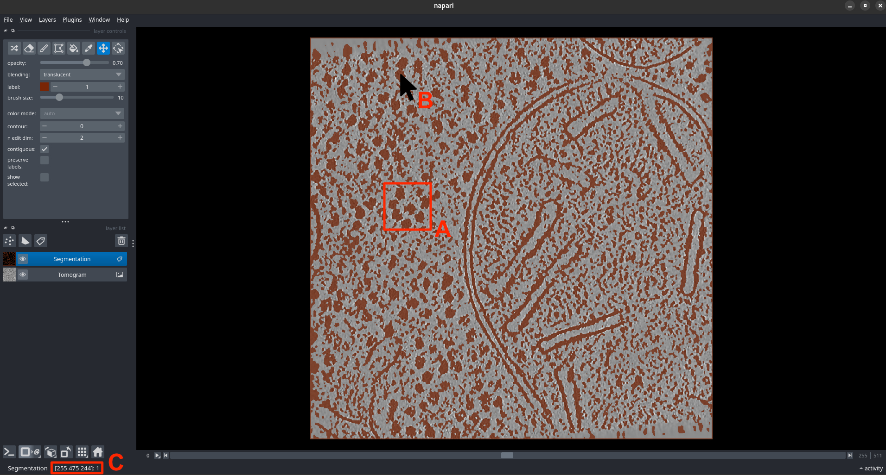

# Obtaining particle cluster ID

Look at the each of the six segmentations generated from S1 for the tomograms in the dataset following the instructions in [visualizing segmentations](visualizing_segmentations.md). Identify the segmentation(s) in which particles are well separated from the background. More than one segmentation may be chosen for the next step. 

For each of the chosen segmentations, identify the voxel value for the voxel corresponding to particles in the segmentation. This value is different for each segmentation. It could be 0 or 1 and is called the `particle_cluster_id`. Either of the following ways can be used to obtain the `particle_cluster_id`:

1. Check if a target particle is colored with a non-gray color in this overlay. If the particle is colored, then `particle_cluster_id = 1`, else `particle_cluster_id = 0`. (See also Fig. 3A. In this figure, it is visually apparent that the particles are segmented in a non-gray color, orange in this case. Therefore, for this example, `particle_cluster_id = 1`.)

2. Hover over a target particle in the loaded Napari window (as shown in Fig. 3B). The `particle_cluster_id` should appear at the bottom of the window next to the coordinates of the mouse pointer (as shown in Fig. 3C).

!!! warning "Important" 
    *The `particle_cluster_id` may not be the same for all the segmentations generated from S1 for a given tomogram.*

    
    
<b>Fig. 3: Obtaining the "particle_cluster_id" 

