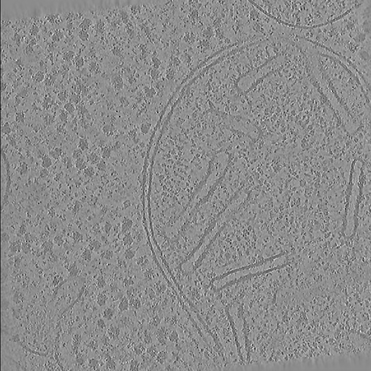

# Step 1 (S1): Generate semantic segmentations 
## Inputs for S1

Inputs for S1 are provided through a YAML file containing parameters. An example is provided in `examples/s1_params_example.yaml`. 

### Dataset related 
These parameters are described in detail below:
```yaml
dataset_name: <An identifier for the dataset> 
```

`dataset_name` is also the name of the directory where all the outputs will be saved.


``` yaml
inputs: 
[  
    {
    tomogram: <path_to_tomogram_1>,
    lower_z-slice_limit: <upper_zslice_where_the_lamella_starts>, #[Optional]#
    upper_z-slice_limit: <lower_zslice_where_the_lamella_ends> #[Optional]#
        },
    {
    tomogram: <path_to_tomogram_2>,
    lower_z-slice_limit: <upper_zslice_where_the_lamella_starts>, #[Optional]#
    upper_z-slice_limit: <lower_zslice_where_the_lamella_ends> #[Optional]#
        },
]
```

`inputs` is a list (enclosed within square brackets) that can be expanded with similar entries, enclosed in curly brackets as shown above. 
<div align="center">
    
    <p align="center"><span class='caption'>Fig. 1: Central Z-slice from an example input tomogram. </span><br/><span class="caption_description">Tomogram obtained from CZI-10301 (Khavnekar, S. <i>et al.</i> Microscopy and Microanalysis (2023))</span> </p>
</div>

`lower_z-slice_limit` and `upper_z-slice_limit` denote the upper and lower bounds on the Z-slices where the `tomogram` is of the highest quality and is most likely to contain good particles. An example input tomogram denoised with TomoEED is shown in Fig 1.  

!!! note "Note"
    *These bounds are only considered for fitting the clustering algorithm that separates particle voxels from background voxels. Particle localizations may still be predicted on Z-slices beyond the mentioned bounds. Using these bounds in S1 may help avoid the contaminants from the periphery of the lamella from confounding the clustering algorithm. (See also: Fig 2).  Moreover, these allow help process larger tomograms without increasing the processing speed and GPU memory requirement.*  

The entries marked as `#[Optional]#` may be omitted. If you do not wish to specify these, these lines should be deleted from from the `param_file.yaml`.

<div align="center">
    
    <p align="center"><span class="caption">Fig. 2: Z-slice bounds for the two steps in PickET. </span><br><span class="caption_description"> The figure shows a slice of a tomogram along the Z-axis along with <br> annotations for the upper and lower bounds to be specified for a PickET run </span></p>
</div>

### PickET core parameters
```yaml
neighborhood_size: 5
```

We recommend using the `neighborhood_size: 5` for picking particles from tomograms. This corresponds to a neighborhood of $5 \times 5 \times 5$ voxels around a given voxel. 

```yaml
max_num_neighborhoods_for_fitting: 100_000_000 
```

This parameter specifies the number of voxels to be used for fitting the clustering algorithm. Reducing this number will reduce the computational memory/time, but will come at the cost of accuracy. On the contrary, increasing this number will increase the time/memory but may result in better segmentations.

We recommend users to optimize this number according to the computing time and GPU memory available. This number needs to be optimized only once for a computing node. Once optimized, the same can be used for all datasets that will be processed using PickET on that computing node in the future.

!!! note "Note"
    *The number of neighborhoods being used in a run is shown in the terminal output for the run. It will be shown as `Features array of shape: (<num_neighborhoods_being_used>, <num_features_extracted>)` in the terminal output.*  

### Feature extraction parameters
```yaml
feature_extraction_params: 
[
    {
    mode: ffts, 
    n_fft_subsets: 64,
        },
    
    {
    mode: gabor, 
    num_sinusoids: 10, 
    num_neighborhoods_subsets: 5,
    num_parallel_filters: 8,
    num_output_features: 64
        },
    
    {
    mode: intensities
        }  
]
```

These parameters describe the feature extraction modes. Similar to `inputs`, `feature_extraction_params` is also a list of dictionaries. Each dictionary defined in this list describes a feature extraction mode. Here, we provide three feature extraction modes `ffts`, `gabor` and `intensities`. 

First, for `mode: ffts`, there is only one parameter, `n_fft_subsets`. This parameter defines how many neighborhoods will be processed simultaneously for feature extraction. Higher the value, the faster the FFT feature extraction, but higher the computational memory required.

Second, for `mode: gabor`, there are four key parameters. The number of Gabor filters used for Gabor feature extraction is the cube of the `num_sinusoids`. The user may choose to not tweak this parameter. The `num_neighborhoods_subsets` and `num_parallel_filters` define the number of neighborhoods and number of Gabor filters to be processed simultaneously. Increasing the `num_neighborhoods_subsets` and reducing the `num_parallel_filters` will result in the feature extraction requiring less GPU memory, but will result in longer runtimes. The `num_output_features` defines the number of features with the highest standard deviation to be used for clustering. The user may choose not to tweak this parameter.

Third, for `mode: intensities`, there are no parameters. It will use the voxel intensities obtained from the neighborhoods as features for clustering.

### Clustering methods
```yaml
clustering_methods: [kmeans, gmm]
```

`clustering_methods` is a list that describes the clustering algorithms to be used. In this example, both `KMeans` as well as `GMM` will be used for clustering.

### Output directory
```yaml
output_dir: /data/picket_results/
```

As the name suggests, `output_dir` describes the path to the directory where the output segmentations will be saved.  

!!! note "Note"
    *The segmentations will be saved in `output_dir/dataset_name/` directory.*

<br/>

---

[Back to Home](index.md)  
[Go to usage instructions](usage_instructions.md)  
[Go to running s1](running_s1.md)
