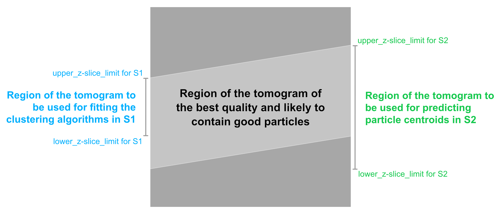

# Step 2 (S2): Extract particles  
## Inputs for S2:

Inputs for S1 are provided through a YAML file containing parameters. An example is provided in `examples/s1_params_example.yaml`. These parameters are described in detail below:

    dataset_name: <An identifier for the dataset>
`dataset_name` is also the name of the directory where all the outputs will be saved.

    inputs: 
    [  
        {
            segmentation: <path_to_segmentation_1>, 
            particle_cluster_id: 1,  # Cluster index of the particle cluster 
            lower_z-slice_limit: <upper_zslice_where_the_lamella_starts>, #[Optional]#
            upper_z-slice_limit: <lower_zslice_where_the_lamella_ends> #[Optional]#
            },
        {
            segmentation: <path_to_segmentation_1>, 
            particle_cluster_id: 0,
            lower_z-slice_limit: <upper_zslice_where_the_lamella_starts>, #[Optional]#
            upper_z-slice_limit: <lower_zslice_where_the_lamella_ends> #[Optional]#
            },
    ]
`inputs` is a list (enclosed within square brackets) that can be expanded with similar entries, enclosed in curly brackets as shown above.  
`segmentation` and the corresponding `particle_cluster_id` are obtained from the [Visualizing segmentations from S1](run_picket.md#vis_seg_s1). 
`lower_z-slice_limit` and `upper_z-slice_limit` denote the upper and lower bounds on the Z-slices where the tomogram is likely to contain particles. Note that these bounds define the bounds on the region from which particles will be picked. These bounds can be more relaxed than the ones used in [Step 1 (S1)](s1.md). See also Fig 2.  

    
    
<b>Fig. 2:</b> Z-slice bounds for the two steps in PickET 

  

 

    particle_extraction_params: 
    [
        {mode: connected_component_labeling},
        {mode: watershed_segmentation, min_distance: 15}
    ]
Similar to the `inputs`, `particle_extraction_params` is also a list of dictionaries. Each dictionary defined in this list defines a particle extraction mode. Here, we provide two particle extraction modes `connected_component_labeling` and `watershed_segmentation`. 

First, for `mode: connected_component_labeling`, there are no hyperparameters. This mode is fast and works well for less crowded datasets.

Second, for `mode: watershed_segmentation`, there is one hyperparameter. This mode uses the watershed segmentation workflow for splitting semantic segmentation into instance segmentation. It uses the `min_distance` hyperparameter that defines the minimum separation between two detected particles in voxels.

    extract_subtomograms: True
    subtomogram_size: 31
Setting the value of `extract_subtomograms` to `True` will result in extracting the subtomograms of size `subtomogram_size` around each predicted particle centroid in .npy file format. If the user does not wish to extract the subtomograms or wants only the centroids, they can set `extract_subtomograms` to `False`. In this case, the value set to `subtomogram_size` will be ignored.

    output_dir: /data/picket_results/
As the name suggests, `output_dir` describes the path to the directory where the output segmentations will be saved.  
*Note:* The extracted particle centroid coordinates will be saved as `.ndjson` files in `output_dir/dataset_name/predicted_particles/` directory. And, the subtomograms, if extracted, will be saved in `output_dir/dataset_name/predicted_particles/subtomograms/` directory.

 

---
 

[Back to Home](../README.md)  
[Go to usage instructions](usage_instructions.md)  
[Go to running s2](running_s2.md)
