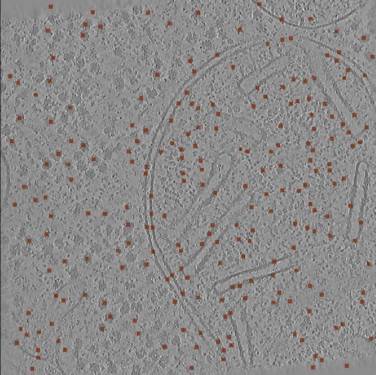

# Understanding the outputs from PickET:
A standard run of the PickET workflow results in the following outputs:
1. Semantic segmentations from S1
2. Instance segmentations from S2
3. Predicted particle centroids from S2

These are described in more details below:

<br>

## Output from S1
The output from S1 is a number of semantic segmentations. These can be visualized using the instructions in [visualizing segmentations](../docs/visualizing_segmentations.md). *Note that for each input tomogram several output semantic segmentations will be generated - each using one of the PickET S1 workflows (for example intensities_kmeans, intensities_gmm, gabor_kmeans, etc.).* The users may choose to use more than one of these semantic segmentations in the next step, S2.

<div align="center">
    
    <p align="center"><b>Fig. 2A: Output from S1 - Semantic segmentation </b></p>
</div>

Before proceeding to the next step, one needs to identify the `particle_cluster_id` corresponding to each of the semantic segmentation step that will be passed to S2. Refer to [obtaining particle cluster ID](../docs/obtaining_particle_cluster_id.md) for further instructions on this.

<br>

## Output from S2
The principal output from S2 is a number of `.yaml` files containing the predicted particle coordinates along with its associated metadata. These files are text files that can be opened in any text editor. One can also visualize the predicted centroids overlayed on the input tomogram using [see centroids script](../accessories/see_centroids.py) (Fig. 4). This script can be run as follows:
```bash
python accessories/see_centroids.py <path_to_predicted_centroids>
```
*Note that for each input tomogram several output particle centroid prediction files will be generated - each using one of the PickET S1 and S2 workflows (for example intensities_kmeans_CC, intensities_kmeans_WS, gabor_kmeans_CC, gabor_kmeans_WS, etc.). In general, the number of output prediction files will be two times the number of input semantic segmentations.*

In addition, instance segmentations will also be generated associated with each of the predicted centroids file. These can be visualized using the same [visualizing segmentations](../docs/visualizing_segmentations.md) workflow described above (Fig. 2B).

<div style="display: flex; justify-content: center;">
    <div align="center" style="margin-right: 100px;">
        
        <p align="center"><b>Fig. 2B: Output from S2 - Instance segmentation</b></p>
    </div>
    <div align="center">
        
        <p align="center"><b>Fig. 4: Output from S2 - Predicted centroids</b></p>
    </div>
</div>

<br/>


The predicted particle coordinates are based on Cartesian coordinate system that assumes the top-left-front of the tomogram to be the origin (0,0,0). These predicted coordinates can be converted to assume any other point in the tomogram as the origin and the origin adjusted predictions can be exported in `.csv` format using the [converter script](../accessories/offset_correct_pred_centroids_and_convert_to_csv.py) which can be run as follows:
```bash
python accessories/offset_correct_pred_centroids_and_convert_to_csv.py -i <input_fname> -o <output_dir> -n "<new_origin>"
```
where `<new_origin>` must be specified as `"(z,y,x)"` where z, y, and x are coordinates of the new origin with respect to the current origin (top-left-front) of the tomogram specified as integers.  
*Note that `<new_origin>` must be specified within quotes.*

<br/>

Subtomograms corresponding to the particle centroids may also be extracted as `.npy` files using the [subtomogram extraction script](../accessories/extract_subtomograms.py) as follows:
```bash
python accessories/extract_subtomograms.py <coords_fpath> <subtomogram_size> <output_dir>
```
where `coords_fpath` corresponds to the path to a `.yaml` predicted coordinates file; `subtomogram_size` corresponds to the size of the subtomograms specified in number of voxels; and `output_dir` is the path to the directory where the extracted subtomograms should be saved.


