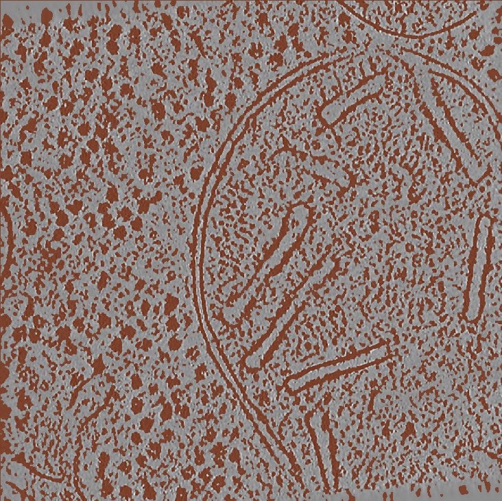
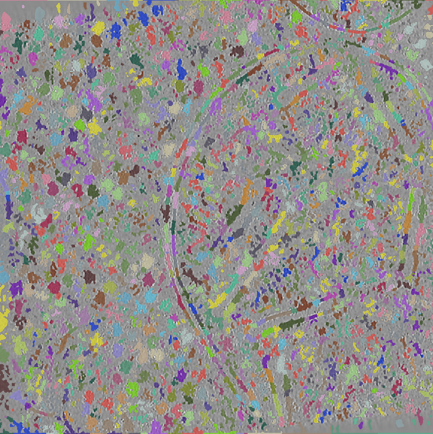

# Visualizing segmentations

!!! note "Note"
    *This step launches the [Napari](https://napari.org/) GUI. If the PickET workflow is being run on a remote computing node, we recommend users to connect to the remote computing node using `ssh` with `-X` flag. In other words, connect to the remote computing node using the following command:*  

```bash
ssh -X <username>@<ip_address of the remote computing node>
```

Now, run the following command on each of the segmentations to visualize an overlay of the segmentation on the input tomogram in Napari:  
```bash
python accessories/see_segmentations.py <path_to_segmentation> <segmentation_type>
```

where `segmentation_type` is either `semantic_segmentation` or `instance_segmentation`.

<div style="display: flex; justify-content: center;">
    <div align="center" style="margin-right: 100px;">
        
        <p align="center"><span class="caption">Fig. 2A: Output from S1 - Semantic segmentation</span></p>
    </div>
    <div align="center">
        
        <p align="center"><span class="caption">Fig. 2B: Output from S2 - Instance segmentation</span></p>
    </div>
</div>
<br/>

---

[Back to Home](index.md)  
[Go to usage instructions](usage_instructions.md)  
[Go to obtaining particle cluster ID](obtaining_particle_cluster_id.md)  